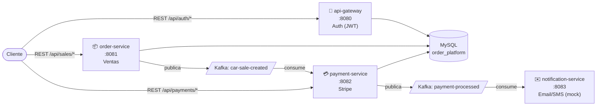

# 🚗 Car Sales Platform

[](https://github.com/BrahianLomas/order-processing-platform/actions/workflows/ci.yml)

🌐 **Idioma:** Español · [English](README.md)

Plataforma de microservicios orientada a eventos para venta de vehículos, construida con **Spring Boot 4**, **Apache Kafka**, **Spring Security (JWT)** y **Stripe**. Es un proyecto de portafolio para demostrar arquitectura de microservicios, diseño orientado a eventos, y prácticas cercanas a producción (seguridad, respuestas de API homologadas, configuración externalizada).

📖 **Documentación completa bilingüe (arquitectura, flujo de datos, cada servicio a fondo, eventos Kafka, referencia de API):** [`docs/`](docs/Home.md) — un vault de [Obsidian](https://obsidian.md), también legible como Markdown plano en GitHub.

## Arquitectura



`api-gateway` emite y firma el JWT; `order-service` y `payment-service` lo validan cada uno por su cuenta (mismo secreto compartido) en vez de confiar en una capa de gateway compartida — ver [Decisiones de Diseño](docs/es/01-Architecture/04-Design-Decisions.md) para el por qué, y qué agregaría un gateway real.

## Características

- **Flujo orientado a eventos**: crear una venta publica `CarSaleCreatedEvent` → `payment-service` cobra vía Stripe → publica `PaymentProcessedEvent` → `notification-service` envía una confirmación
- **Autenticación JWT** validada de forma independiente por 3 servicios (no solo el gateway), con una respuesta 401 homologada ante un token ausente/inválido
- **Resilience4j** (retry + circuit breaker) en la integración con Stripe
- **Respuestas de API homologadas**: la respuesta de cada endpoint extiende una clase base común `GenericResponse` (`response_code` / `description` / `timestamp`) en vez de `Map`/formatos de error improvisados — ver [Formato de Respuesta](docs/es/04-API-Reference/00-Response-Format.md)
- **Secretos externalizados** vía un `.env` gitignored, inyectado automáticamente en `./gradlew bootRun` — nada sensible está hardcodeado en archivos versionados
- **37 tests unitarios** (JUnit 5 + Mockito) cubriendo lógica de negocio real — cálculo de precio, reglas de cancelación, JWT, Bean Validation
- **CI en cada push** (GitHub Actions) corriendo la suite de tests completa + build
- **Documentación bilingüe** (ES/EN) cubriendo arquitectura, flujo de datos, cada servicio, cada evento Kafka y cada endpoint, con diagramas

## Stack Tecnológico

| | |
|---|---|
| Lenguaje / Runtime | Java 21 |
| Framework | Spring Boot 4 (Gradle multi-módulo) |
| Seguridad | Spring Security + JWT (HS256, `auth0/java-jwt`) |
| Mensajería | Apache Kafka (Confluent) |
| Base de datos | MySQL 8.0 |
| Pagos | Stripe Java SDK (modo test) |
| Resiliencia | Resilience4j (Retry + Circuit Breaker) |
| Mapeo | MapStruct |
| Infra (local) | Docker Compose (MySQL, Kafka, Zookeeper) |

Detalle completo del stack: [docs/es/06-Technologies/01-Stack.md](docs/es/06-Technologies/01-Stack.md)

## Inicio Rápido

```bash
git clone https://github.com/BrahianLomas/order-processing-platform.git
cd order-processing-platform

# 1. Infraestructura (MySQL, Kafka, Zookeeper)
docker-compose up -d

# 2. Secretos — el repo ya trae un .env de desarrollo funcional, o crea el tuyo:
cp .env.example .env

# 3. Compilar
./gradlew build

# 4. Levantar cada servicio (en terminales separadas)
./gradlew :api-gateway:bootRun
./gradlew :order-service:bootRun
./gradlew :payment-service:bootRun
./gradlew :notification-service:bootRun
```

Guía completa (incluyendo cómo sembrar un customer y probar el flujo con curl): [docs/es/02-Setup/02-Local-Setup.md](docs/es/02-Setup/02-Local-Setup.md)

## Pruébalo

- **Swagger UI** (con los servicios corriendo) — pública, no necesitas token para explorarla; click en **Authorize** y pega un JWT de `/auth/login` para probar los endpoints protegidos interactivamente:
  - api-gateway: http://localhost:8080/api/swagger-ui/index.html
  - order-service: http://localhost:8081/api/swagger-ui/index.html
  - payment-service: http://localhost:8082/api/swagger-ui/index.html
- **Colección de Postman**: [`docs/assets/postman/order-processing-platform.postman_collection.json`](docs/assets/postman/order-processing-platform.postman_collection.json) — encadena registro → login → crear venta → consultar pago
- **Referencia de API con ejemplos de request/response**: [docs/es/04-API-Reference/](docs/es/04-API-Reference/01-Authentication.md)

## Limitaciones Conocidas / Roadmap

Este es un proyecto de portafolio, no un sistema en producción — estos son recortes de alcance deliberados, no descuidos:

- `api-gateway` emite JWTs pero no enruta tráfico hacia los demás servicios (no hay Spring Cloud Gateway)
- No hay capa de API-key/mTLS entre servicios — Kafka y las llamadas REST protegidas por JWT son el único límite entre servicios
- No hay Dead Letter Topic — un consumidor de Kafka que falla solo registra el error y sigue
- Los pagos están simulados: `payment-service` marca un cobro como `PAID` justo después de crear el `PaymentIntent` de Stripe, sin verificar el estado real
- Las notificaciones se registran en logs, no se envían (sin proveedor real de email/SMS)
- Un único esquema MySQL compartido entre servicios, no base de datos por servicio

Lista completa con justificación: [docs/es/01-Architecture/04-Design-Decisions.md](docs/es/01-Architecture/04-Design-Decisions.md)

## Mapa de la Documentación

| | |
|---|---|
| 🏛️ Arquitectura | [Diseño del sistema, flujo de datos, decisiones](docs/es/01-Architecture/01-System-Design.md) |
| ⚙️ Instalación | [Prerrequisitos, setup local, cómo correr los servicios](docs/es/02-Setup/01-Prerequisites.md) |
| 🧩 Servicios | [Detalle de cada servicio](docs/es/03-Services/01-API-Gateway.md) |
| 📡 API Reference | [Formato de respuesta, endpoints con ejemplos](docs/es/04-API-Reference/00-Response-Format.md) |
| 📨 Eventos Kafka | [Tópicos y esquemas de eventos](docs/es/05-Kafka-Events/01-Topics.md) |
| 🛠️ Tecnologías | [Stack y patrones de diseño](docs/es/06-Technologies/01-Stack.md) |

---

Hecho por [BrahianLomas](https://github.com/BrahianLomas)
