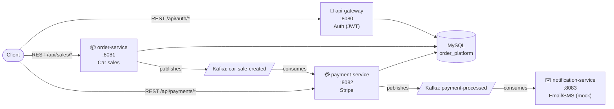

# 🚗 Car Sales Platform

[](https://github.com/BrahianLomas/order-processing-platform/actions/workflows/ci.yml)

🌐 **Language:** English · [Español](README.es.md)

Event-driven microservices platform for car sales, built with **Spring Boot 4**, **Apache Kafka**, **Spring Security (JWT)** and **Stripe**. Built as a portfolio project to demonstrate microservices architecture, event-driven design, and production-adjacent practices (security, homologated API responses, externalized config).

📖 **Full bilingual documentation (architecture, data flow, per-service deep dives, Kafka events, API reference):** [`docs/`](docs/Home.md) — an [Obsidian](https://obsidian.md) vault, also readable as plain Markdown on GitHub.

## Architecture



`api-gateway` issues and signs the JWT; `order-service` and `payment-service` each validate it independently (same shared secret) rather than trusting a shared gateway layer — see [Design Decisions](docs/en/01-Architecture/04-Design-Decisions.md) for why, and what a real gateway would add.

## Features

- **Event-driven flow**: creating a sale publishes `CarSaleCreatedEvent` → `payment-service` charges via Stripe → publishes `PaymentProcessedEvent` → `notification-service` sends a confirmation
- **JWT authentication** validated independently by 3 services (not just the gateway), with a homologated 401 response on a missing/invalid token
- **Resilience4j** retry + circuit breaker around the Stripe integration
- **Homologated API responses**: every endpoint's response extends a common `GenericResponse` base (`response_code` / `description` / `timestamp`) instead of ad-hoc `Map`/error shapes — see [Response Format](docs/en/04-API-Reference/00-Response-Format.md)
- **Secrets externalized** via a gitignored `.env`, auto-injected into `./gradlew bootRun` — nothing sensitive is hardcoded in tracked files
- **Bilingual documentation** (ES/EN) covering architecture, data flow, every service, every Kafka event, and every endpoint, with diagrams

## Tech Stack

| | |
|---|---|
| Language / Runtime | Java 21 |
| Framework | Spring Boot 4 (multi-module Gradle) |
| Security | Spring Security + JWT (HS256, `auth0/java-jwt`) |
| Messaging | Apache Kafka (Confluent) |
| Database | MySQL 8.0 |
| Payments | Stripe Java SDK (test mode) |
| Resilience | Resilience4j (Retry + Circuit Breaker) |
| Mapping | MapStruct |
| Infra (local) | Docker Compose (MySQL, Kafka, Zookeeper) |

Full stack details: [docs/en/06-Technologies/01-Stack.md](docs/en/06-Technologies/01-Stack.md)

## Quick Start

```bash
git clone https://github.com/BrahianLomas/order-processing-platform.git
cd order-processing-platform

# 1. Infrastructure (MySQL, Kafka, Zookeeper)
docker-compose up -d

# 2. Secrets — the repo ships a working dev .env, or make your own:
cp .env.example .env

# 3. Build
./gradlew build

# 4. Run each service (separate terminals)
./gradlew :api-gateway:bootRun
./gradlew :order-service:bootRun
./gradlew :payment-service:bootRun
./gradlew :notification-service:bootRun
```

Full walkthrough (including seeding a customer and a curl-based end-to-end test): [docs/en/02-Setup/02-Local-Setup.md](docs/en/02-Setup/02-Local-Setup.md)

## Try It

- **Swagger UI** (once the services are running) — public, no token needed to browse; click **Authorize** and paste a JWT from `/auth/login` to try protected endpoints interactively:
  - api-gateway: http://localhost:8080/api/swagger-ui/index.html
  - order-service: http://localhost:8081/api/swagger-ui/index.html
  - payment-service: http://localhost:8082/api/swagger-ui/index.html
- **Postman collection**: [`docs/assets/postman/order-processing-platform.postman_collection.json`](docs/assets/postman/order-processing-platform.postman_collection.json) — chains register → login → create sale → check payment
- **API reference with request/response examples**: [docs/en/04-API-Reference/](docs/en/04-API-Reference/01-Authentication.md)

## Known Limitations / Roadmap

This is a portfolio project, not a production system — these are deliberate scope cuts, not oversights:

- `api-gateway` issues JWTs but doesn't route traffic to the other services (no Spring Cloud Gateway)
- No API-key/mTLS layer between services — Kafka messages and the JWT-secured REST calls are the only inter-service boundary
- No Dead Letter Topic — a failed Kafka consumer just logs and moves on
- Payments are simulated: `payment-service` marks a charge `PAID` right after creating the Stripe `PaymentIntent`, without checking Stripe's actual status
- Notifications are logged, not sent (no real email/SMS provider)
- Single shared MySQL schema across services, not database-per-service

Full list with rationale: [docs/en/01-Architecture/04-Design-Decisions.md](docs/en/01-Architecture/04-Design-Decisions.md)

## Documentation Map

| | |
|---|---|
| 🏛️ Architecture | [System design, data flow, design decisions](docs/en/01-Architecture/01-System-Design.md) |
| ⚙️ Setup | [Prerequisites, local setup, running services](docs/en/02-Setup/01-Prerequisites.md) |
| 🧩 Services | [Per-service deep dive](docs/en/03-Services/01-API-Gateway.md) |
| 📡 API Reference | [Response format, endpoints with examples](docs/en/04-API-Reference/00-Response-Format.md) |
| 📨 Kafka Events | [Topics and event schemas](docs/en/05-Kafka-Events/01-Topics.md) |
| 🛠️ Technologies | [Stack and design patterns](docs/en/06-Technologies/01-Stack.md) |

---

Built by [BrahianLomas](https://github.com/BrahianLomas)
