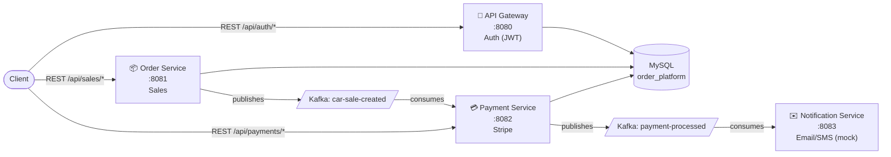

🌐 **Language:** English · [Español](../es/00-Home.md)

# 🚗 Car Sales Platform — Documentation

> **Event-driven microservices** architecture for a car sales platform, built with **Spring Boot 4**, **Apache Kafka** and **Stripe**.

## 📋 Overview

| | |
|---|---|
| **Architecture style** | Microservices + Event-Driven Architecture |
| **Language / Runtime** | Java 21 |
| **Framework** | Spring Boot 4 (Gradle multi-module) |
| **Persistence** | MySQL 8.0 (single schema `order_platform`) |
| **Messaging** | Apache Kafka (via Confluent) |
| **Payments** | Stripe (*test mode*, simulated) |
| **Modules** | `shared-lib`, `api-gateway`, `order-service`, `payment-service`, `notification-service` |

## 🏗️ High-Level Architecture

> [!info] A note on the name "API Gateway"
> Despite its name, `api-gateway` does **not** route traffic to the other services — it is purely an **authentication** microservice (register/login/JWT). Every other service is called directly and independently. See [[04-Design-Decisions|Design Decisions]] for more context.

## 🚀 Quick Start

1. [[02-Setup/01-Prerequisites|Prerequisites]]
2. [[02-Setup/02-Local-Setup|Local Setup Guide]]
3. [[02-Setup/03-Running-Services|Running the Services]]
4. [[04-API-Reference/01-Authentication|Authenticate and get a token]]

## 🗺️ Documentation Map

| Section | Content |
|---|---|
| 🏛️ [[01-Architecture/01-System-Design\|Architecture]] | System design, components, data flow, design decisions |
| ⚙️ [[02-Setup/01-Prerequisites\|Setup]] | Prerequisites, local setup, running the services |
| 🧩 [[03-Services/01-API-Gateway\|Services]] | Deep dive on each microservice: responsibilities, entities, configuration |
| 📡 [[04-API-Reference/00-Response-Format\|API Reference]] | Homologated response format (`GenericResponse`) and REST endpoints with examples |
| 📨 [[05-Kafka-Events/01-Topics\|Kafka Events]] | Topics, event schemas, producers and consumers |
| 🛠️ [[06-Technologies/01-Stack\|Technologies]] | Technical stack and design patterns applied |
| 🧪 [[07-Testing/01-Postman-Collection\|Testing]] | Postman collection for testing the end-to-end flow |

## 🔑 Services and Ports

| Service | Port | Prefix | Main responsibility |
|---|---|---|---|
| [[03-Services/01-API-Gateway\|api-gateway]] | `8080` | `/api` | Registration, login and JWT |
| [[03-Services/02-Order-Service\|order-service]] | `8081` | `/api` | Car sale management |
| [[03-Services/03-Payment-Service\|payment-service]] | `8082` | `/api` | Stripe charges |
| [[03-Services/04-Notification-Service\|notification-service]] | `8083` | `/api` | Notifications (mock) |

> [!warning] Project status
> This is a learning/demo project. Before any real deployment, review the **"Known Limitations"** section in [[01-Architecture/04-Design-Decisions|Design Decisions]] (plaintext secrets, missing security on internal services, simulated payments, etc.).

---

**Last updated:** 2026-09-03
