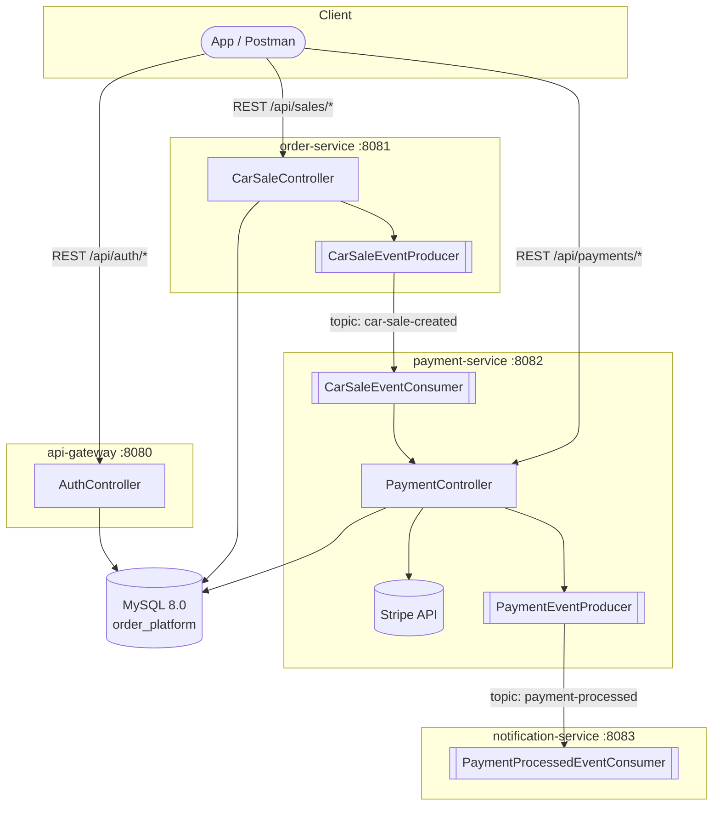

🌐 **Language:** English · [Español](../../es/01-Architecture/01-System-Design.md)
🏠 [[../00-Home|Home]] › Architecture › System Design

# 🏛️ System Design

## Overview

The system is an **event-driven microservices** architecture, designed to decouple responsibilities: each service owns its own deployment lifecycle and communicates with the others through **Apache Kafka**, avoiding chained synchronous calls between internal services.

## Components

### 🔐 API Gateway
- **Actual purpose:** an **authentication** microservice (register, login, JWT refresh). It does not route requests to the other services or act as a reverse proxy — despite the name, it uses no Spring Cloud Gateway or Eureka.
- **Port:** `8080`
- **Responsibilities:**
  - User registration and login (`bcrypt` password hashing)
  - JWT issuance and validation (HS256, via `auth0/java-jwt`)
  - User persistence in MySQL (`users` table)
- Full detail: [[../03-Services/01-API-Gateway|API Gateway]]

### 📦 Order Service
- **Purpose:** manage car sales and publish the sale-created event.
- **Port:** `8081`
- **Responsibilities:**
  - Partial CRUD for car sales (`car_sales`)
  - Price calculation: tax and total amount
  - Publish `CarSaleCreatedEvent` to the `car-sale-created` topic
  - Validate customer existence by email
- Full detail: [[../03-Services/02-Order-Service|Order Service]]

### 💳 Payment Service
- **Purpose:** process payments through Stripe.
- **Port:** `8082`
- **Responsibilities:**
  - Consume `CarSaleCreatedEvent` from Kafka
  - Create a Stripe `PaymentIntent` (test mode)
  - Retries and circuit breaking via Resilience4j
  - Publish `PaymentProcessedEvent` to the `payment-processed` topic
- Full detail: [[../03-Services/03-Payment-Service|Payment Service]]

### ✉️ Notification Service
- **Purpose:** notify the customer (simulated).
- **Port:** `8083`
- **Responsibilities:**
  - Consume `PaymentProcessedEvent` from Kafka
  - "Send" a confirmation email/SMS — in practice, it only logs formatted messages (no real provider integration exists)
- Full detail: [[../03-Services/04-Notification-Service|Notification Service]]

## Communication

### Synchronous (REST)
- Client → API Gateway (auth)
- Client → Order Service (sales)
- Client → Payment Service (payment lookup)
- Payment Service → Stripe API

### Asynchronous (Kafka)
- `order-service` → `car-sale-created` → `payment-service`
- `payment-service` → `payment-processed` → `notification-service`

> [!note] Decoupled services, single database
> Even though each service owns its own set of JPA entities, **all four services point at the same MySQL schema** (`order_platform`). There is no physical database-per-service separation — see [[04-Design-Decisions|Design Decisions]].

## Database

- **MySQL 8.0**, schema `order_platform`
- Tables: `users` (api-gateway), `customers` and `car_sales` (order-service), `payments` (payment-service)
- `notification-service` declares a datasource but defines no entity or repository

## Message Broker

- **Apache Kafka** (`confluentinc/cp-kafka:7.5.0`) + **Zookeeper** (`confluentinc/cp-zookeeper:7.5.0`)
- Topics: [[../05-Kafka-Events/01-Topics|Topics]]

## Security

- `api-gateway`, `order-service` and `payment-service` all implement Spring Security + their own JWT filter (same pattern: `JwtAuthenticationFilter` + `SecurityConfig`), and require a valid JWT on every endpoint
- All three share the same `app.jwt.secret` (via `.env`, not hardcoded) — `api-gateway` signs, the other two only validate
- `notification-service` still has no security, but it exposes no REST endpoint, so there's nothing to protect
- There is no role-based access control (RBAC): authentication only distinguishes "valid" vs "invalid/missing"
- Detail: [[../04-API-Reference/01-Authentication|Authentication]]

---

**Design patterns applied:** see [[../06-Technologies/02-Patterns-Used|Patterns Used]]

**See also:** [[02-Microservices-Overview|Microservices Overview]] · [[03-Data-Flow|Complete Data Flow]] · [[04-Design-Decisions|Design Decisions]]
