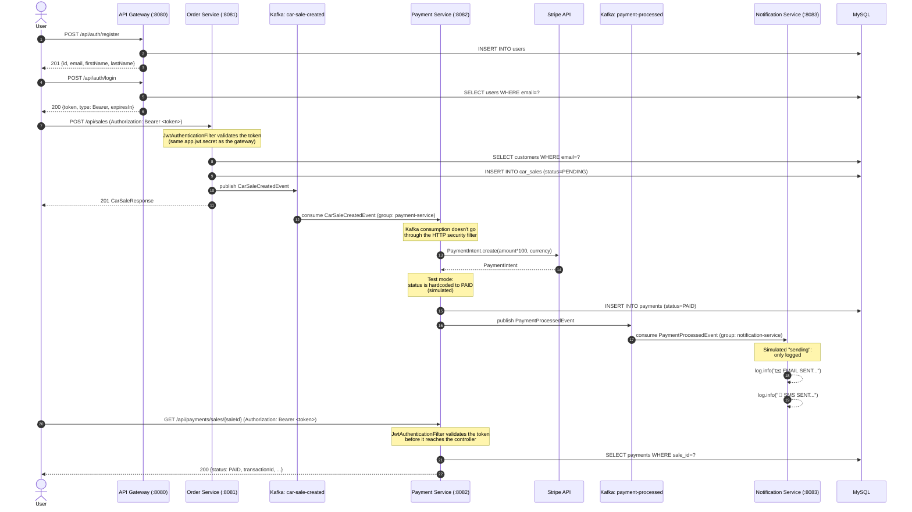

🌐 **Language:** English · [Español](../../es/01-Architecture/03-Data-Flow.md)
🏠 [[../00-Home|Home]] › Architecture › Data Flow

# 🔄 Complete Data Flow

End-to-end walkthrough of a car sale, from user registration to the final notification.

## Key takeaways

1. **The JWT is validated in three services.** `api-gateway` signs it; `order-service` and `payment-service` validate it with the same `app.jwt.secret`. `notification-service` doesn't validate it, but it also exposes no REST endpoints. Kafka consumption (between `order-service` and `payment-service`, and between `payment-service` and `notification-service`) never passes through any HTTP security filter — that only protects incoming REST requests.
2. **Pricing happens in `order-service`:** `tax = (salePrice - discount) * 0.08` and `totalAmount = salePrice - discount + tax`. Curiously, the `sale_price` field on the `CarSaleCreatedEvent` is populated with `totalAmount`, not the raw sale price — see [[../05-Kafka-Events/02-CarSaleCreatedEvent|CarSaleCreatedEvent]].
3. **The payment is simulated.** `payment-service` always marks the payment as `PAID` after creating the `PaymentIntent`, regardless of the actual status Stripe returns (there's an explicit code comment: *"EN TEST MODE, SIMULAR PAGADO"*).
4. **No Dead Letter Topic.** If the Kafka listener throws an exception, it is only logged — there is no topic-level retry or error queue.
5. **The notification is 100% simulated.** There is no integration with any email/SMS provider (no SMTP, no Twilio, no SES).

---

**See also:** [[01-System-Design|System Design]] · [[../05-Kafka-Events/01-Topics|Kafka Topics]]
