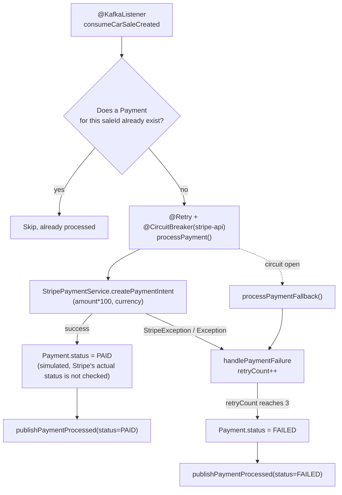

🌐 **Language:** English · [Español](../../es/03-Services/03-Payment-Service.md)
🏠 [[../00-Home|Home]] › Services › Payment Service

# 💳 Payment Service

| | |
|---|---|
| **Port** | `8082` |
| **Context path** | `/api` |
| **Base package** | `org.example.payment` |
| **Entry point** | `Main` (`@EnableKafka`) |
| **Database** | `payments` table |

## Package structure

```
org.example.payment
├── config
│   ├── GlobalExceptionHandler
│   ├── JwtConfig                   (JwtUtil bean)
│   ├── KafkaConfig                 (producer for PaymentProcessedEvent)
│   ├── OpenApiConfig               (Swagger metadata + bearerAuth scheme)
│   ├── RestAuthenticationEntryPoint (homologated 401 without a token)
│   ├── SecurityConfig              (filter chain)
│   └── StripeConfig                (Stripe.apiKey via @PostConstruct)
├── controller.PaymentController    (/payments)
├── dto.PaymentResponse             (extends GenericResponse)
├── entity.Payment                  (payments table)
├── filter
│   └── JwtAuthenticationFilter     (OncePerRequestFilter)
├── kafka
│   ├── CarSaleEventConsumer
│   ├── KafkaConsumerConfig
│   └── PaymentEventProducer
├── repository.PaymentRepository
├── service
│   ├── PaymentService (interface)
│   └── impl.PaymentServiceImpl
└── stripe.StripePaymentService
```

## `Payment` entity (`payments` table)

| Field | Type | Notes |
|---|---|---|
| `id` | `Long` | PK, `IDENTITY` |
| `saleId` | `Long` | unique, not null |
| `customerId` | `Long` | not null |
| `amount` | `BigDecimal` | not null |
| `currency` | `String` | not null |
| `stripePaymentIntentId` | `String` | unique |
| `status` | `String` | `PENDING` / `PAID` / `FAILED` |
| `errorMessage` | `TEXT` | error message on failure |
| `retryCount` | `Integer` | default `0` |
| `createdAt` / `updatedAt` | `LocalDateTime` | `@PrePersist`/`@PreUpdate` |

No JPA relationships exist (`saleId`/`customerId` are plain FKs — no `@ManyToOne` crossing the service boundary).

## Payment processing flow



> [!danger] The payment is always marked successful
> `PaymentServiceImpl.processPayment` sets `status = PAID` immediately after creating the `PaymentIntent`, without inspecting its actual status (`requires_action`, `processing`, etc.). The code itself labels this a test-mode simulation.

## Stripe integration

- `StripeConfig` sets `Stripe.apiKey` from `stripe.api.key` (`@PostConstruct`)
- `StripePaymentService.createPaymentIntent(saleId, amount, currency)`: converts the amount to cents (`amount * 100`), adds `metadata.saleId`, calls `PaymentIntent.create(params)`
- **No Stripe webhook exists** (`/webhook`) — payment confirmation is entirely simulated, not driven by real Stripe events
- The `stripe.api.version=2023-10-16` property is defined but **never used** in code; the `stripe-java:23.10.0` SDK's default version applies instead

## Resilience4j

```properties
resilience4j.retry.instances.stripe-api.max-attempts=3
resilience4j.retry.instances.stripe-api.wait-duration=1000
resilience4j.retry.instances.stripe-api.retry-exceptions=java.io.IOException

resilience4j.circuitbreaker.instances.stripe-api.failure-rate-threshold=50
resilience4j.circuitbreaker.instances.stripe-api.wait-duration-in-open-state=10000
resilience4j.circuitbreaker.instances.stripe-api.permitted-number-of-calls-in-half-open-state=3
```

`processPayment` is annotated with `@Retry(name="stripe-api")` and `@CircuitBreaker(name="stripe-api", fallbackMethod="processPaymentFallback")`.

## Endpoints

Full detail in [[../04-API-Reference/03-Payment-Endpoints|API Reference: Payments]].

| Method | Path | Description |
|---|---|---|
| `GET` | `/api/payments/sales/{saleId}` | Looks up the payment for a sale; 404 if none exists |

> [!note] No endpoint to create payments manually
> Payments are only generated as a reaction to the `CarSaleCreatedEvent`. The single REST endpoint is **read-only**.

## 🔐 Security

`payment-service` validates the same JWT that `api-gateway` signs (same `app.jwt.secret`, HS256). `GET /payments/sales/{saleId}` requires a valid token:

```java
.authorizeHttpRequests(authorize -> authorize
    .anyRequest().authenticated()
)
.addFilterBefore(jwtAuthenticationFilter, UsernamePasswordAuthenticationFilter.class);
```

No valid token → `401 Unauthorized` with a `GenericResponse` body (`response_code: E004`), generated by `RestAuthenticationEntryPoint`, never reaching `PaymentController`. See [[../04-API-Reference/00-Response-Format|Response Format]]. This does **not** protect Kafka consumption (`CarSaleEventConsumer`) — Kafka messages don't go through the HTTP security filter, only REST requests do. Verified live alongside [[02-Order-Service|Order Service]].

## 📖 Swagger UI

Public, no authentication: **`http://localhost:8082/api/swagger-ui/index.html`**. Has an **Authorize** button (`bearerAuth` scheme) to paste the JWT and try `GET /payments/sales/{saleId}` from the browser.

## Kafka

| Role | Topic | Class |
|---|---|---|
| Consumer (`group: payment-service`) | `car-sale-created` | `CarSaleEventConsumer` |
| Producer | `payment-processed` | `PaymentEventProducer` |

## Notable configuration (`application.properties`)

```properties
server.port=8082
spring.datasource.password=${DB_PASSWORD}
spring.kafka.consumer.group-id=payment-service
spring.kafka.consumer.properties.spring.json.type.mapping=carSaleCreatedEvent:org.example.shared.dto.CarSaleCreatedEvent
stripe.api.key=${STRIPE_API_KEY}
app.jwt.secret=${JWT_SECRET}
app.jwt.expiration=86400000
```

> [!tip] Stripe key, JWT secret, and MySQL password are no longer hardcoded
> All three are read from environment variables, resolved from a root-level `.env` (gitignored) that `bootRun` injects automatically. See [[../01-Architecture/04-Design-Decisions|Design Decisions]] and [[../02-Setup/02-Local-Setup|Local Setup Guide]].

---

**See also:** [[04-Notification-Service|Notification Service]] · [[../05-Kafka-Events/03-PaymentProcessedEvent|PaymentProcessedEvent]]
