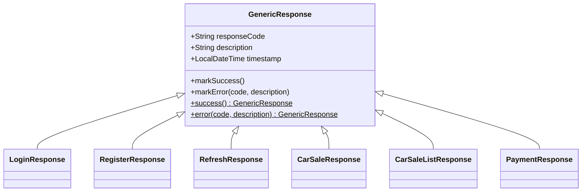

🌐 **Language:** English · [Español](../../es/04-API-Reference/00-Response-Format.md)
🏠 [[../00-Home|Home]] › API Reference › Response Format

# 📐 Homologated Response Format (`GenericResponse`)

Every endpoint in `api-gateway`, `order-service` and `payment-service` responds with a homologated format, defined once in `shared-lib` (`org.example.shared.response`).

## Design: inheritance, not a `data` wrapper

Instead of wrapping every payload in a generic `data` field, **each concrete response extends `GenericResponse`** and adds its own fields alongside `response_code` / `description` / `timestamp`:

```java
public class GenericResponse {
    protected String responseCode;
    protected String description;
    protected LocalDateTime timestamp;
}

public class LoginResponse extends GenericResponse {
    private String token;
    private String type;
    private Long expiresIn;
    private UserSummary user;
}
```

This keeps business fields "flat" at the top level of the JSON (compatible with existing clients that already read `response.token` or `response.id`), instead of forcing `response.data.token`.



## `ResponseCode` catalog

| Code | Default description | When it's used |
|---|---|---|
| `00` | Successful | Any successful response (`markSuccess()`) |
| `E001` | Internal Error | Uncaught exception (`GlobalExceptionHandler` → `Exception`) |
| `E002` | Business rule violation | `BusinessException` (order-service, api-gateway) |
| `E003` | Payment processing error | `PaymentException` (payment-service) |
| `E004` | Unauthorized | Missing/invalid/expired JWT — returned by `RestAuthenticationEntryPoint` (401) or by failed login/refresh |
| `E005` | Invalid input | Reserved for when `@Valid`/Bean Validation is added (not implemented yet) |
| `E006` | Resource not found | Sale or payment not found (404) |
| `E007` | Resource already exists | Reserved (e.g. duplicate email on register) |
| `E008` | External service error | Reserved (e.g. Stripe/Kafka failures not covered today by another code) |

> [!note] Reserved codes
> `E005`, `E007` and `E008` are defined in the enum but **not yet used** by any controller — they're ready for when input validation (`@Valid`) or other mechanisms are added. Don't assume they're already wired up.

## Example — success (`POST /api/auth/login`)

```json
{
  "token": "eyJhbGciOiJIUzI1NiJ9...",
  "type": "Bearer",
  "expiresIn": 86400000,
  "user": { "id": 4, "email": "demo@test.com", "firstName": "Demo", "lastName": "User" },
  "response_code": "00",
  "description": "Successful",
  "timestamp": "2026-09-12T09:15:30.576"
}
```

## Example — business error (`POST /api/sales`, customer not found)

```json
{
  "response_code": "E002",
  "description": "Cliente no encontrado",
  "timestamp": "2026-09-12T08:54:08.630"
}
```

## Example — missing or invalid token (any `order-service`/`payment-service` endpoint)

```json
{
  "response_code": "E004",
  "description": "Token faltante, inválido o expirado",
  "timestamp": "2026-09-12T09:15:29.916"
}
```
`HTTP 401` — generated by `RestAuthenticationEntryPoint`, **before** the request ever reaches a controller. Before this change, this response had no body at all (a bare `403`) — see [[../01-Architecture/04-Design-Decisions|Design Decisions]].

## List responses (`GET /api/sales/customer/{id}`)

A `List<T>` can't "extend" `GenericResponse` (a JSON array has no object fields), so list responses use a dedicated wrapper class:

```java
public class CarSaleListResponse extends GenericResponse {
    private List<CarSaleResponse> sales;
}
```

```json
{
  "sales": [ { "id": 1, "customer_id": 1, "...": "..." } ],
  "response_code": "00",
  "description": "Successful",
  "timestamp": "2026-09-12T09:15:31.488"
}
```

> [!tip] Why don't list items carry their own `response_code`?
> `CarSaleResponse` serves double duty: it's the full response of `GET /sales/{id}` (there it does get its own `response_code: 00` via `.markSuccess()`) and it's also each row inside `sales` in the list response (there it's nested data, not an independent response).
>
> `.markSuccess()` is only called on the object returned directly as the HTTP body (`CarSaleListResponse`) — never on each item inside it. The reason: in this code, **a single item can never fail on its own** — if one row had a problem, the whole query breaks and the endpoint returns an error at the wrapper level, not a mix of items with different `response_code`s. Forcing `"00"` onto every item would just repeat the same value N times with no new information.
>
> Thanks to `@JsonInclude(Include.NON_NULL)` on the base class, each item's `response_code`/`description`/`timestamp` fields (which would otherwise be `null`) are omitted from the JSON instead of showing up as noise. This was an explicitly confirmed decision — see [[../01-Architecture/04-Design-Decisions|Design Decisions]].

## Replaces `ApiErrorResponse`

Before this change, each `GlobalExceptionHandler` returned an `ApiErrorResponse` (with `error_code`, `message`, `details`, `path`) **for errors only**, while successful responses had no common format across services. `ApiErrorResponse` was removed from `shared-lib` — `GenericResponse` covers both cases.

---

**See also:** [[01-Authentication|Authentication]] · [[02-Sales-Endpoints|Sales Endpoints]] · [[03-Payment-Endpoints|Payment Endpoints]] · [[../01-Architecture/04-Design-Decisions|Design Decisions]]
