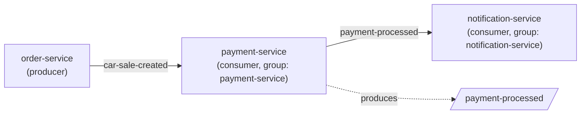

🌐 **Language:** English · [Español](../../es/05-Kafka-Events/01-Topics.md)
🏠 [[../00-Home|Home]] › Kafka Events › Topics

# 📨 Kafka Topics

Both topic names are defined once in `shared-lib`, in `AppConstants`:

```java
public static final String TOPIC_CAR_SALE_CREATED = "car-sale-created";
public static final String TOPIC_PAYMENT_PROCESSED = "payment-processed";
```



## `car-sale-created`

| | |
|---|---|
| **Producer** | `order-service` → `CarSaleEventProducer` |
| **Consumer** | `payment-service` → `CarSaleEventConsumer` (`group-id: payment-service`) |
| **Triggered when** | `POST /api/sales` successfully creates a sale |
| **Payload** | [[02-CarSaleCreatedEvent\|CarSaleCreatedEvent]] |

## `payment-processed`

| | |
|---|---|
| **Producer** | `payment-service` → `PaymentEventProducer` |
| **Consumer** | `notification-service` → `PaymentProcessedEventConsumer` (`group-id: notification-service`) |
| **Triggered when** | `payment-service` finishes processing a payment (success or failure) |
| **Payload** | [[03-PaymentProcessedEvent\|PaymentProcessedEvent]] |

## Serialization

| | Key | Value |
|---|---|---|
| Producers | `StringSerializer` | `JsonSerializer` (Spring Kafka) |
| Consumers | `StringDeserializer` | `JsonDeserializer` (Spring Kafka) |

Common consumer configuration:
```properties
spring.kafka.consumer.auto-offset-reset=earliest
spring.kafka.consumer.properties.spring.json.trusted.packages=*
```

`payment-service` additionally sets an explicit type mapping for deserialization:
```properties
spring.kafka.consumer.properties.spring.json.type.mapping=carSaleCreatedEvent:org.example.shared.dto.CarSaleCreatedEvent
```

## Infrastructure

- **Broker:** `confluentinc/cp-kafka:7.5.0`, `bootstrap-servers=localhost:9092`
- **Coordination:** `confluentinc/cp-zookeeper:7.5.0`
- **Topic auto-creation:** enabled (`KAFKA_AUTO_CREATE_TOPICS_ENABLE=true`) — there are no manual creation scripts or explicit partition/replication configuration

> [!warning] No topic-level error handling
> Neither consumer has a Dead Letter Topic or a Spring Kafka retry policy (`SeekToCurrentErrorHandler`/`DefaultErrorHandler`) configured. Exceptions inside the `@KafkaListener` are only logged — the message is treated as "processed" (the offset still advances).

---

**See also:** [[02-CarSaleCreatedEvent|CarSaleCreatedEvent]] · [[03-PaymentProcessedEvent|PaymentProcessedEvent]] · [[../01-Architecture/03-Data-Flow|Data Flow]]
