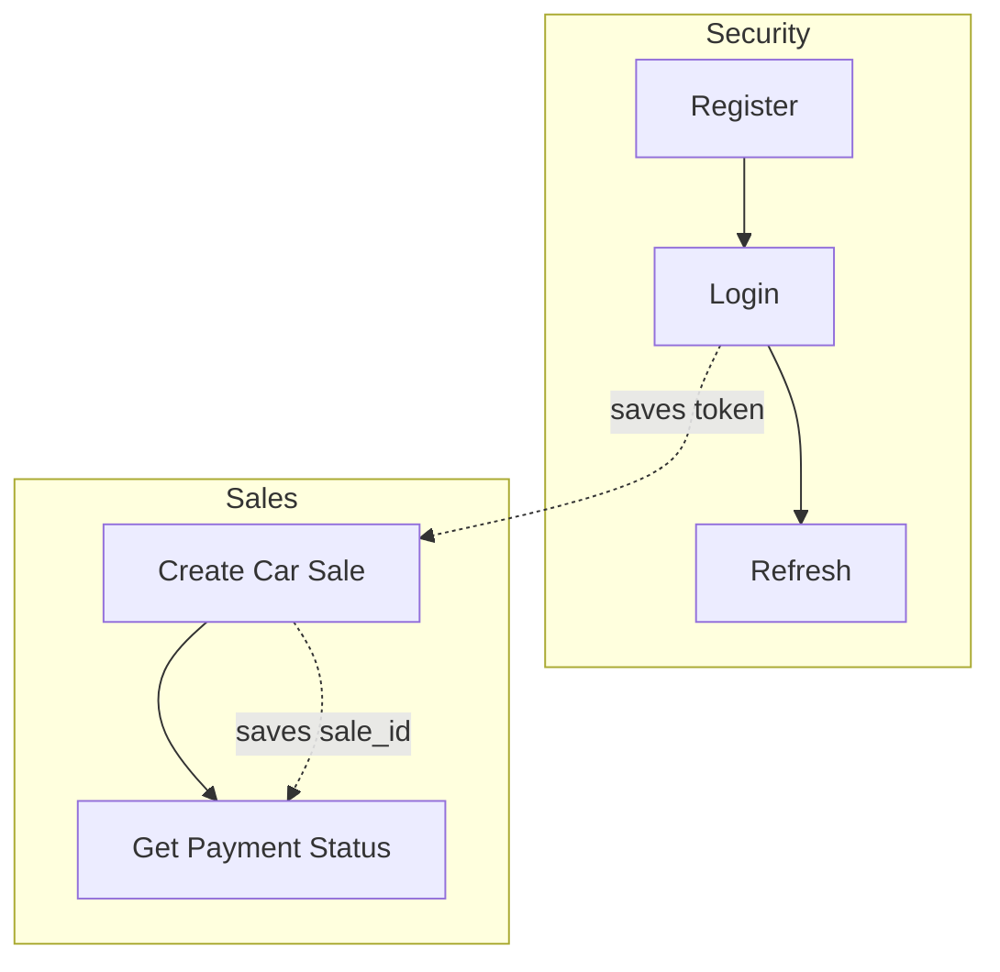

🌐 **Language:** English · [Español](../../es/07-Testing/01-Postman-Collection.md)
🏠 [[../00-Home|Home]] › Testing › Postman Collection

# 🧪 Postman Collection

The repository includes a real Postman collection, used to manually test the end-to-end flow.

📎 **File:** [`order-processing-platform.postman_collection.json`](../../assets/postman/order-processing-platform.postman_collection.json)

## How to import it

1. Open Postman → **Import** → select the `.json` file above.
2. Create an **Environment** with these variables (the collection doesn't ship an exported one):

| Variable | Suggested value |
|---|---|
| `gateway_url` | `http://localhost:8080/api` |
| `order_url` | `http://localhost:8081/api` |
| `payment_url` | `http://localhost:8082/api` |
| `token` | *(auto-filled, see below)* |
| `sale_id` | *(auto-filled, see below)* |

## Collection structure



### 🔐 Security
| Request | Method | Endpoint | Test script |
|---|---|---|---|
| **Register** | `POST` | `{{gateway_url}}/auth/register` | — |
| **Login** | `POST` | `{{gateway_url}}/auth/login` | If `200`, saves `token` to the environment |
| **Refresh** | `POST` | `{{gateway_url}}/auth/refresh` (header `Authorization: Bearer {{token}}`) | If `200`, saves the new `token` |

### 📦 Sales
| Request | Method | Endpoint | Auth | Test script |
|---|---|---|---|---|
| **Create Car Sale** | `POST` | `{{order_url}}/sales` | header `Authorization: Bearer {{token}}` | If `201`, saves `sale_id` to the environment |
| **Get Payment Status** | `GET` | `{{payment_url}}/payments/sales/{{sale_id}}` | header `Authorization: Bearer {{token}}` | ⚠️ see note below |

> [!tip] Run "Login" before "Sales"
> Now that `order-service` and `payment-service` have Spring Security, both requests in the **Sales** folder need a valid `{{token}}` in the environment — run **Login** first (it saves the token automatically).

## Sample data used (Create Car Sale)

```json
{
  "customerEmail": "juan@example.com",
  "vehicleVin": "1HGCM82633A004352",
  "vehicleMake": "Honda",
  "vehicleModel": "Accord",
  "vehicleYear": 2023,
  "vehicleColor": "Azul",
  "vehicleMileage": 15000,
  "salePrice": 25000.00,
  "discount": 500.00
}
```

> [!warning] Requires a pre-existing `customer`
> Just like in [[../02-Setup/02-Local-Setup|Local Setup Guide]], `order-service` looks up the customer by `customerEmail` in the `customers` table. Before running **Create Car Sale**, manually insert a row with `email = "juan@example.com"` into that table (there's no endpoint to create customers).

## 🐛 Inconsistencies found in the collection

Cross-checking the collection against the actual source code turned up a couple of details worth knowing before you use it (the collection file already ships with item 0 fixed):

0. ~~**"Create Car Sale" was missing the `Authorization` header.**~~ **Fixed.** Now that `order-service` requires a JWT (see [[../01-Architecture/04-Design-Decisions|Design Decisions]]), `Authorization: Bearer {{token}}` was added to that request in the collection file.
1. **The "Get Payment Status" test script is copied from "Create Car Sale".** It checks `pm.response.code === 201` and reads `jsonData.id` to re-save `sale_id` — but `GET /payments/sales/{saleId}` responds `200 OK`, not `201`, so that condition never triggers (harmless — the script just doesn't do anything useful there).
2. **The "Get Payment Status" request includes a JSON body** (the same sale payload) despite being a `GET`. Postman allows it (`disableBodyPruning: true`), but the body is ignored by `payment-service` — it can be removed with no effect.
3. **Inconsistent JSON casing across services:** `order-service`'s response (`CarSaleResponse`) uses `snake_case` (`customer_id`, `sale_price`...), while `payment-service`'s (`GET /payments/sales/{saleId}`) uses `camelCase` (`saleId`, `transactionId`...). See [[../04-API-Reference/02-Sales-Endpoints|Sales Endpoints]] and [[../04-API-Reference/03-Payment-Endpoints|Payment Endpoints]].

---

**See also:** [[../04-API-Reference/01-Authentication|Authentication]] · [[../02-Setup/02-Local-Setup|Local Setup Guide]]
