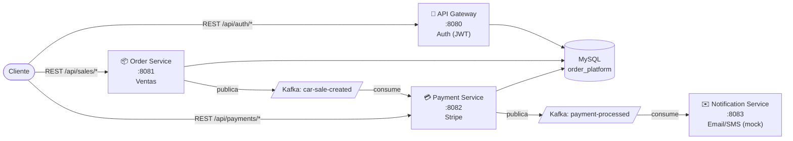

🌐 **Idioma:** Español · [English](../en/00-Home.md)

# 🚗 Car Sales Platform — Plataforma de Venta de Vehículos

> Arquitectura de **microservicios orientada a eventos** para una plataforma de venta de autos, construida con **Spring Boot 4**, **Apache Kafka** y **Stripe**.

## 📋 Resumen

| | |
|---|---|
| **Estilo arquitectónico** | Microservicios + Event-Driven Architecture |
| **Lenguaje / Runtime** | Java 21 |
| **Framework** | Spring Boot 4 (Gradle multi-módulo) |
| **Persistencia** | MySQL 8.0 (esquema único `order_platform`) |
| **Mensajería** | Apache Kafka (vía Confluent) |
| **Pagos** | Stripe (modo *test*, simulado) |
| **Módulos** | `shared-lib`, `api-gateway`, `order-service`, `payment-service`, `notification-service` |

## 🏗️ Arquitectura a alto nivel

> [!info] Nota sobre el nombre "API Gateway"
> A pesar del nombre, `api-gateway` **no enruta tráfico** hacia los otros servicios: es únicamente un microservicio de **autenticación** (registro/login/JWT). Cada servicio se consume de forma directa e independiente. Ver [[04-Design-Decisions|Decisiones de Diseño]] para más contexto.

## 🚀 Inicio Rápido

1. [[02-Setup/01-Prerequisites|Prerrequisitos]]
2. [[02-Setup/02-Local-Setup|Guía de Instalación Local]]
3. [[02-Setup/03-Running-Services|Cómo levantar cada servicio]]
4. [[04-API-Reference/01-Authentication|Autenticarse y obtener un token]]

## 🗺️ Mapa de la Documentación

| Sección | Contenido |
|---|---|
| 🏛️ [[01-Architecture/01-System-Design\|Arquitectura]] | Diseño del sistema, componentes, flujo de datos, decisiones de diseño |
| ⚙️ [[02-Setup/01-Prerequisites\|Instalación]] | Prerrequisitos, setup local, cómo correr los servicios |
| 🧩 [[03-Services/01-API-Gateway\|Servicios]] | Detalle de cada microservicio: responsabilidades, entidades, configuración |
| 📡 [[04-API-Reference/00-Response-Format\|API Reference]] | Formato de respuesta homologado (`GenericResponse`) y endpoints REST con ejemplos |
| 📨 [[05-Kafka-Events/01-Topics\|Eventos Kafka]] | Tópicos, esquemas de eventos, productores y consumidores |
| 🛠️ [[06-Technologies/01-Stack\|Tecnologías]] | Stack técnico y patrones de diseño aplicados |
| 🧪 [[07-Testing/01-Postman-Collection\|Testing]] | Colección de Postman para probar el flujo end-to-end |

## 🔑 Servicios y Puertos

| Servicio | Puerto | Prefijo | Responsabilidad principal |
|---|---|---|---|
| [[03-Services/01-API-Gateway\|api-gateway]] | `8080` | `/api` | Registro, login y JWT |
| [[03-Services/02-Order-Service\|order-service]] | `8081` | `/api` | Gestión de ventas de vehículos |
| [[03-Services/03-Payment-Service\|payment-service]] | `8082` | `/api` | Cobro vía Stripe |
| [[03-Services/04-Notification-Service\|notification-service]] | `8083` | `/api` | Notificaciones (mock) |

> [!warning] Estado del proyecto
> Este es un proyecto de aprendizaje/demostración. Antes de cualquier despliegue real, revisa la sección **"Limitaciones conocidas"** en [[01-Architecture/04-Design-Decisions|Decisiones de Diseño]] (secretos en texto plano, ausencia de seguridad en servicios internos, pagos simulados, etc.).

---

**Última actualización:** 2026-09-03
