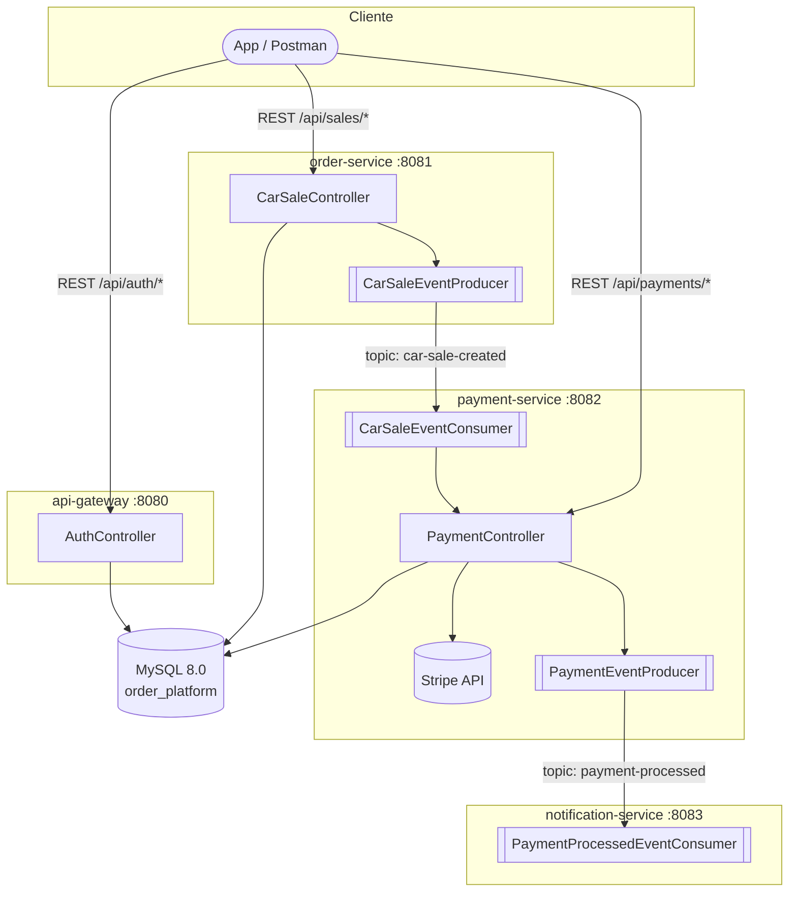

🌐 **Idioma:** Español · [English](../../en/01-Architecture/01-System-Design.md)
🏠 [[../00-Home|Inicio]] › Arquitectura › Diseño del Sistema

# 🏛️ Diseño del Sistema

## Visión general

El sistema es una arquitectura de **microservicios orientada a eventos**, diseñada para desacoplar responsabilidades: cada servicio posee su propio ciclo de vida de despliegue y se comunica con los demás mediante **Apache Kafka**, evitando llamadas síncronas encadenadas entre servicios internos.

## Componentes

### 🔐 API Gateway
- **Propósito real:** microservicio de **autenticación** (registro, login, refresh de token JWT). No enruta peticiones hacia los demás servicios ni actúa como *reverse proxy* — pese a su nombre, no usa Spring Cloud Gateway ni Eureka.
- **Puerto:** `8080`
- **Responsabilidades:**
  - Registro y login de usuarios (`bcrypt` para contraseñas)
  - Emisión y validación de JWT (HS256, vía `auth0/java-jwt`)
  - Persistencia de usuarios en MySQL (tabla `users`)
- Detalle completo: [[../03-Services/01-API-Gateway|API Gateway]]

### 📦 Order Service
- **Propósito:** gestionar las ventas de vehículos y publicar el evento de venta creada.
- **Puerto:** `8081`
- **Responsabilidades:**
  - CRUD (parcial) de ventas de vehículos (`car_sales`)
  - Cálculo de precio: impuesto y monto total
  - Publicar `CarSaleCreatedEvent` al tópico `car-sale-created`
  - Validar existencia del cliente por email
- Detalle completo: [[../03-Services/02-Order-Service|Order Service]]

### 💳 Payment Service
- **Propósito:** procesar pagos mediante Stripe.
- **Puerto:** `8082`
- **Responsabilidades:**
  - Consumir `CarSaleCreatedEvent` desde Kafka
  - Crear un `PaymentIntent` en Stripe (modo test)
  - Reintentos y *circuit breaker* con Resilience4j
  - Publicar `PaymentProcessedEvent` al tópico `payment-processed`
- Detalle completo: [[../03-Services/03-Payment-Service|Payment Service]]

### ✉️ Notification Service
- **Propósito:** notificar al cliente (simulado).
- **Puerto:** `8083`
- **Responsabilidades:**
  - Consumir `PaymentProcessedEvent` desde Kafka
  - "Enviar" confirmación por email/SMS — en la práctica, solo registra logs formateados (no hay integración real con ningún proveedor)
- Detalle completo: [[../03-Services/04-Notification-Service|Notification Service]]

## Comunicación

### Síncrona (REST)
- Cliente → API Gateway (auth)
- Cliente → Order Service (ventas)
- Cliente → Payment Service (consulta de pagos)
- Payment Service → Stripe API

### Asíncrona (Kafka)
- `order-service` → `car-sale-created` → `payment-service`
- `payment-service` → `payment-processed` → `notification-service`

> [!note] Servicios desacoplados, pero con una única base de datos
> Aunque cada servicio tiene su propio conjunto de entidades JPA, **los cuatro servicios apuntan al mismo esquema MySQL** (`order_platform`). No hay separación física de bases de datos por servicio — ver [[04-Design-Decisions|Decisiones de Diseño]].

## Base de datos

- **MySQL 8.0**, esquema `order_platform`
- Tablas: `users` (api-gateway), `customers` y `car_sales` (order-service), `payments` (payment-service)
- `notification-service` declara un datasource pero no define ninguna entidad ni repositorio

## Message Broker

- **Apache Kafka** (imagen `confluentinc/cp-kafka:7.5.0`) + **Zookeeper** (`confluentinc/cp-zookeeper:7.5.0`)
- Tópicos: [[../05-Kafka-Events/01-Topics|Topics]]

## Seguridad

- `api-gateway`, `order-service` y `payment-service` implementan Spring Security + un filtro JWT propio (mismo patrón: `JwtAuthenticationFilter` + `SecurityConfig`), y exigen un JWT válido en todos sus endpoints
- Los tres comparten el mismo `app.jwt.secret` (vía `.env`, no hardcodeado) — `api-gateway` firma, los otros dos solo validan
- `notification-service` sigue sin seguridad, pero no expone ningún endpoint REST, así que no hay nada que proteger
- No hay control de roles (RBAC): la autenticación solo distingue "válido" vs "inválido/ausente"
- Detalle: [[../04-API-Reference/01-Authentication|Autenticación]]

---

**Patrones de diseño aplicados:** ver [[../06-Technologies/02-Patterns-Used|Patrones Utilizados]]

**Ver también:** [[02-Microservices-Overview|Resumen de Microservicios]] · [[03-Data-Flow|Flujo de Datos Completo]] · [[04-Design-Decisions|Decisiones de Diseño]]
