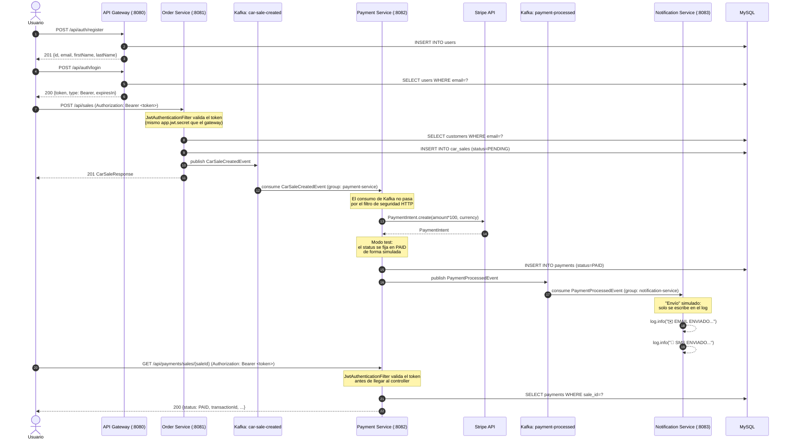

🌐 **Idioma:** Español · [English](../../en/01-Architecture/03-Data-Flow.md)
🏠 [[../00-Home|Inicio]] › Arquitectura › Flujo de Datos

# 🔄 Flujo de Datos Completo

Recorrido end-to-end de una venta de vehículo, desde el registro del usuario hasta la notificación final.

## Puntos clave del flujo

1. **El JWT se valida en tres servicios.** `api-gateway` lo firma; `order-service` y `payment-service` lo validan con el mismo `app.jwt.secret`. `notification-service` no lo valida, pero tampoco expone endpoints REST. El consumo de Kafka (entre `order-service` y `payment-service`, y entre `payment-service` y `notification-service`) no pasa por ningún filtro de seguridad HTTP — solo protege las peticiones REST entrantes.
2. **El cálculo de precio ocurre en `order-service`:** `tax = (salePrice - discount) * 0.08` y `totalAmount = salePrice - discount + tax`. Curiosamente, el campo `sale_price` del evento `CarSaleCreatedEvent` se llena con `totalAmount`, no con el precio bruto — ver [[../05-Kafka-Events/02-CarSaleCreatedEvent|CarSaleCreatedEvent]].
3. **El pago está simulado.** `payment-service` siempre marca el pago como `PAID` tras crear el `PaymentIntent`, independientemente del estado real que devuelva Stripe (comentario explícito en el código: *"EN TEST MODE, SIMULAR PAGADO"*).
4. **No hay Dead Letter Topic.** Si el consumidor de Kafka lanza una excepción, esta solo se registra en el log; no existe reintento a nivel de tópico ni cola de errores.
5. **La notificación es 100% simulada.** No hay integración con ningún proveedor de email/SMS (sin SMTP, sin Twilio, sin SES).

---

**Ver también:** [[01-System-Design|Diseño del Sistema]] · [[../05-Kafka-Events/01-Topics|Tópicos de Kafka]]
