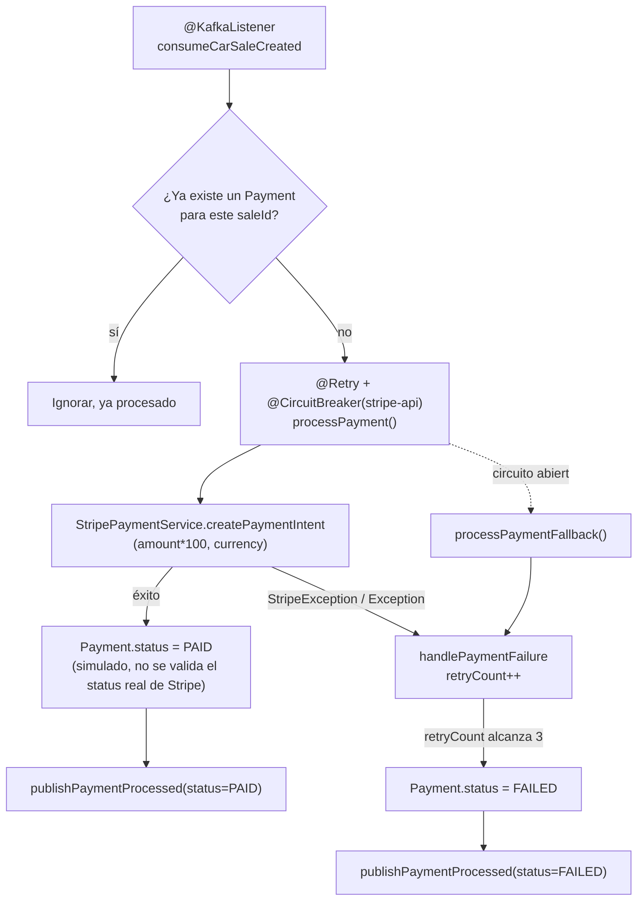

🌐 **Idioma:** Español · [English](../../en/03-Services/03-Payment-Service.md)
🏠 [[../00-Home|Inicio]] › Servicios › Payment Service

# 💳 Payment Service

| | |
|---|---|
| **Puerto** | `8082` |
| **Context path** | `/api` |
| **Base package** | `org.example.payment` |
| **Entry point** | `Main` (`@EnableKafka`) |
| **Base de datos** | tabla `payments` |

## Estructura de paquetes

```
org.example.payment
├── config
│   ├── GlobalExceptionHandler
│   ├── JwtConfig                   (bean JwtUtil)
│   ├── KafkaConfig                 (producer PaymentProcessedEvent)
│   ├── OpenApiConfig               (metadata Swagger + esquema bearerAuth)
│   ├── RestAuthenticationEntryPoint (401 homologado sin token)
│   ├── SecurityConfig              (filter chain)
│   └── StripeConfig                (Stripe.apiKey vía @PostConstruct)
├── controller.PaymentController    (/payments)
├── dto.PaymentResponse             (extends GenericResponse)
├── entity.Payment                  (tabla payments)
├── filter
│   └── JwtAuthenticationFilter     (OncePerRequestFilter)
├── kafka
│   ├── CarSaleEventConsumer
│   ├── KafkaConsumerConfig
│   └── PaymentEventProducer
├── repository.PaymentRepository
├── service
│   ├── PaymentService (interfaz)
│   └── impl.PaymentServiceImpl
└── stripe.StripePaymentService
```

## Entidad `Payment` (tabla `payments`)

| Campo | Tipo | Notas |
|---|---|---|
| `id` | `Long` | PK, `IDENTITY` |
| `saleId` | `Long` | único, not null |
| `customerId` | `Long` | not null |
| `amount` | `BigDecimal` | not null |
| `currency` | `String` | not null |
| `stripePaymentIntentId` | `String` | único |
| `status` | `String` | `PENDING` / `PAID` / `FAILED` |
| `errorMessage` | `TEXT` | mensaje de error si falla |
| `retryCount` | `Integer` | default `0` |
| `createdAt` / `updatedAt` | `LocalDateTime` | `@PrePersist`/`@PreUpdate` |

No hay relaciones JPA (`saleId`/`customerId` son FKs simples, sin `@ManyToOne` cruzando el límite de servicio).

## Flujo de procesamiento de pago



> [!danger] El pago siempre se marca como exitoso
> `PaymentServiceImpl.processPayment` fija `status = PAID` inmediatamente después de crear el `PaymentIntent`, sin inspeccionar su estado real (`requires_action`, `processing`, etc.). El propio código lo etiqueta como simulación de modo test.

## Integración con Stripe

- `StripeConfig` fija `Stripe.apiKey` desde `stripe.api.key` (`@PostConstruct`)
- `StripePaymentService.createPaymentIntent(saleId, amount, currency)`: convierte el monto a centavos (`amount * 100`), agrega `metadata.saleId`, llama `PaymentIntent.create(params)`
- **No existe webhook de Stripe** (`/webhook`) — la confirmación de pago es completamente simulada, no impulsada por eventos reales de Stripe
- La propiedad `stripe.api.version=2023-10-16` está definida pero **no se usa** en ningún código; aplica la versión por defecto del SDK `stripe-java:23.10.0`

## Resilience4j

```properties
resilience4j.retry.instances.stripe-api.max-attempts=3
resilience4j.retry.instances.stripe-api.wait-duration=1000
resilience4j.retry.instances.stripe-api.retry-exceptions=java.io.IOException

resilience4j.circuitbreaker.instances.stripe-api.failure-rate-threshold=50
resilience4j.circuitbreaker.instances.stripe-api.wait-duration-in-open-state=10000
resilience4j.circuitbreaker.instances.stripe-api.permitted-number-of-calls-in-half-open-state=3
```

`processPayment` está anotado con `@Retry(name="stripe-api")` y `@CircuitBreaker(name="stripe-api", fallbackMethod="processPaymentFallback")`.

## Endpoints

Ver detalle en [[../04-API-Reference/03-Payment-Endpoints|API Reference: Payments]].

| Método | Ruta | Descripción |
|---|---|---|
| `GET` | `/api/payments/sales/{saleId}` | Consulta el pago asociado a una venta; 404 si no existe |

> [!note] No hay endpoint para crear pagos manualmente
> Los pagos solo se generan como reacción al evento `CarSaleCreatedEvent`. El único endpoint REST es de **lectura**.

## 🔐 Seguridad

`payment-service` valida el mismo JWT que `api-gateway` firma (mismo `app.jwt.secret`, HS256). `GET /payments/sales/{saleId}` requiere un token válido:

```java
.authorizeHttpRequests(authorize -> authorize
    .anyRequest().authenticated()
)
.addFilterBefore(jwtAuthenticationFilter, UsernamePasswordAuthenticationFilter.class);
```

Sin token válido → `401 Unauthorized` con body `GenericResponse` (`response_code: E004`), generado por `RestAuthenticationEntryPoint`, sin llegar a `PaymentController`. Ver [[../04-API-Reference/00-Response-Format|Formato de Respuesta]]. Esto **no** protege el consumo de Kafka (`CarSaleEventConsumer`) — los mensajes de Kafka no pasan por el filtro de seguridad HTTP, solo las peticiones REST. Verificado en caliente junto con [[02-Order-Service|Order Service]].

## 📖 Swagger UI

Público, sin autenticación: **`http://localhost:8082/api/swagger-ui/index.html`**. Con botón **Authorize** (esquema `bearerAuth`) para pegar el JWT y probar `GET /payments/sales/{saleId}` desde el navegador.

## Kafka

| Rol | Tópico | Clase |
|---|---|---|
| Consumidor (`group: payment-service`) | `car-sale-created` | `CarSaleEventConsumer` |
| Productor | `payment-processed` | `PaymentEventProducer` |

## Configuración destacada (`application.properties`)

```properties
server.port=8082
spring.datasource.password=${DB_PASSWORD}
spring.kafka.consumer.group-id=payment-service
spring.kafka.consumer.properties.spring.json.type.mapping=carSaleCreatedEvent:org.example.shared.dto.CarSaleCreatedEvent
stripe.api.key=${STRIPE_API_KEY}
app.jwt.secret=${JWT_SECRET}
app.jwt.expiration=86400000
```

> [!tip] Clave de Stripe, secreto JWT y password de MySQL ya no están hardcodeados
> Los tres se leen de variables de entorno, resueltas desde un `.env` en la raíz del repo (gitignored) que `bootRun` inyecta automáticamente. Ver [[../01-Architecture/04-Design-Decisions|Decisiones de Diseño]] y [[../02-Setup/02-Local-Setup|Guía de Instalación Local]].

---

**Ver también:** [[04-Notification-Service|Notification Service]] · [[../05-Kafka-Events/03-PaymentProcessedEvent|Evento PaymentProcessedEvent]]
