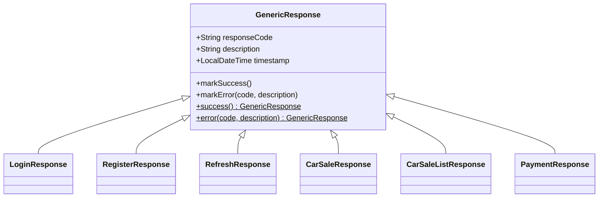

🌐 **Idioma:** Español · [English](../../en/04-API-Reference/00-Response-Format.md)
🏠 [[../00-Home|Inicio]] › API Reference › Formato de Respuesta

# 📐 Formato de Respuesta Homologado (`GenericResponse`)

Todos los endpoints de `api-gateway`, `order-service` y `payment-service` responden con un formato homologado, definido una sola vez en `shared-lib` (`org.example.shared.response`).

## Diseño: herencia, no un wrapper con `data`

En vez de envolver cada payload en un campo genérico `data`, **cada respuesta concreta extiende `GenericResponse`** y agrega sus propios campos junto a `response_code` / `description` / `timestamp`:

```java
public class GenericResponse {
    protected String responseCode;
    protected String description;
    protected LocalDateTime timestamp;
}

public class LoginResponse extends GenericResponse {
    private String token;
    private String type;
    private Long expiresIn;
    private UserSummary user;
}
```

Esto mantiene los campos de negocio "planos" en el nivel superior del JSON (compatible con clientes existentes que ya leían `response.token` o `response.id`), en vez de forzar `response.data.token`.



## Catálogo de `ResponseCode`

| Código | Descripción por defecto | Cuándo se usa |
|---|---|---|
| `00` | Successful | Cualquier respuesta exitosa (`markSuccess()`) |
| `E001` | Internal Error | Excepción no controlada (`GlobalExceptionHandler` → `Exception`) |
| `E002` | Business rule violation | `BusinessException` (order-service, api-gateway) |
| `E003` | Payment processing error | `PaymentException` (payment-service) |
| `E004` | Unauthorized | JWT ausente/inválido/expirado — devuelto por `RestAuthenticationEntryPoint` (401) o por login/refresh fallidos |
| `E005` | Invalid input | Bean Validation (`@Valid` en el body, `@Positive` en path variables) — ver [[../01-Architecture/04-Design-Decisions\|Decisiones de Diseño]] |
| `E006` | Resource not found | Venta o pago no encontrado (404) |
| `E007` | Resource already exists | Reservado (p. ej. email duplicado en registro) |
| `E008` | External service error | Reservado (p. ej. fallos de Stripe/Kafka no cubiertos hoy por otro código) |

> [!note] Códigos reservados
> `E007` y `E008` están definidos en el enum pero **aún no se usan** en ningún controller — quedan listos para futuros casos (p. ej. detectar duplicados explícitamente, o fallos de servicios externos que no son ya `PaymentException`). No asumas que ya están conectados.

## Validación de input (`E005`)

`RegisterRequest`, `LoginRequest` y `CreateCarSaleRequest` usan anotaciones de Bean Validation (`@NotBlank`, `@Email`, `@Size`, `@Positive`, etc.), aplicadas con `@Valid` en el `@RequestBody` del controller. Los path variables (`saleId`, `customerId`) también se validan (`@Positive`) vía `@Validated` a nivel de clase.

Si falla la validación, la petición nunca llega al método del controller — Spring la intercepta y el `GlobalExceptionHandler` de cada servicio arma un solo mensaje combinando todos los campos con error:

```json
{
  "response_code": "E005",
  "description": "email: email must be a valid address, password: password must be at least 8 characters long",
  "timestamp": "2026-09-13T19:32:57.806"
}
```

Para los path variables, el mensaje se limpia para mostrar solo el nombre del campo (no `nombreDelMetodo.campo`, que es como Bean Validation lo reporta por defecto):

```json
{
  "response_code": "E005",
  "description": "saleId: saleId must be a positive number",
  "timestamp": "2026-09-13T19:41:17.155"
}
```

## Ejemplo — éxito (`POST /api/auth/login`)

```json
{
  "token": "eyJhbGciOiJIUzI1NiJ9...",
  "type": "Bearer",
  "expiresIn": 86400000,
  "user": { "id": 4, "email": "demo@test.com", "firstName": "Demo", "lastName": "User" },
  "response_code": "00",
  "description": "Successful",
  "timestamp": "2026-09-12T09:15:30.576"
}
```

## Ejemplo — error de negocio (`POST /api/sales`, cliente inexistente)

```json
{
  "response_code": "E002",
  "description": "Cliente no encontrado",
  "timestamp": "2026-09-12T08:54:08.630"
}
```

## Ejemplo — sin token o token inválido (cualquier endpoint de `order-service`/`payment-service`)

```json
{
  "response_code": "E004",
  "description": "Token faltante, inválido o expirado",
  "timestamp": "2026-09-12T09:15:29.916"
}
```
`HTTP 401` — generado por `RestAuthenticationEntryPoint`, **antes** de llegar al controller. Antes de este cambio, esta respuesta no tenía body (era un `403` vacío) — ver [[../01-Architecture/04-Design-Decisions|Decisiones de Diseño]].

## Respuestas de lista (`GET /api/sales/customer/{id}`)

Un `List<T>` no puede "extender" `GenericResponse` (un array JSON no tiene campos de objeto), así que las respuestas de lista usan una clase envolvente dedicada:

```java
public class CarSaleListResponse extends GenericResponse {
    private List<CarSaleResponse> sales;
}
```

```json
{
  "sales": [ { "id": 1, "customer_id": 1, "...": "..." } ],
  "response_code": "00",
  "description": "Successful",
  "timestamp": "2026-09-12T09:15:31.488"
}
```

> [!tip] ¿Por qué los items de la lista NO llevan su propio `response_code`?
> `CarSaleResponse` cumple doble función: es la respuesta completa de `GET /sales/{id}` (ahí sí lleva su propio `response_code: 00` vía `.markSuccess()`) y también es cada fila dentro de `sales` en la respuesta de lista (ahí es un dato anidado, no una respuesta independiente).
>
> Solo se llama `.markSuccess()` sobre el objeto que se devuelve directamente como body HTTP (`CarSaleListResponse`) — nunca sobre cada item de adentro. La razón es que, en este código, **un item nunca puede fallar por su cuenta**: si una fila tuviera un problema, se rompe la consulta completa y el endpoint devuelve un error a nivel del wrapper, no una mezcla de items con distintos `response_code`. Forzar `"00"` en cada item sería el mismo valor repetido N veces sin aportar información nueva.
>
> Gracias a `@JsonInclude(Include.NON_NULL)` en la clase base, los campos `response_code`/`description`/`timestamp` de cada item (que quedarían en `null`) se omiten del JSON en vez de aparecer como ruido. Decisión confirmada explícitamente — ver [[../01-Architecture/04-Design-Decisions|Decisiones de Diseño]].

## Reemplaza a `ApiErrorResponse`

Antes de este cambio, cada `GlobalExceptionHandler` devolvía una `ApiErrorResponse` (con `error_code`, `message`, `details`, `path`) **solo para errores**, mientras que las respuestas exitosas no tenían ningún formato común entre servicios. `ApiErrorResponse` fue eliminada de `shared-lib` — `GenericResponse` cubre ambos casos.

---

**Ver también:** [[01-Authentication|Autenticación]] · [[02-Sales-Endpoints|Sales Endpoints]] · [[03-Payment-Endpoints|Payment Endpoints]] · [[../01-Architecture/04-Design-Decisions|Decisiones de Diseño]]
