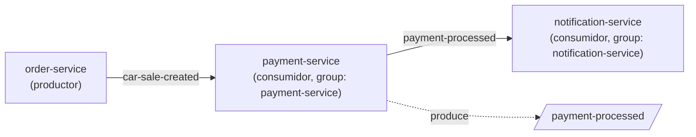

🌐 **Idioma:** Español · [English](../../en/05-Kafka-Events/01-Topics.md)
🏠 [[../00-Home|Inicio]] › Kafka Events › Tópicos

# 📨 Tópicos de Kafka

Ambos nombres de tópico están definidos una sola vez en `shared-lib`, en `AppConstants`:

```java
public static final String TOPIC_CAR_SALE_CREATED = "car-sale-created";
public static final String TOPIC_PAYMENT_PROCESSED = "payment-processed";
```



## `car-sale-created`

| | |
|---|---|
| **Productor** | `order-service` → `CarSaleEventProducer` |
| **Consumidor** | `payment-service` → `CarSaleEventConsumer` (`group-id: payment-service`) |
| **Se dispara cuando** | `POST /api/sales` crea una venta exitosamente |
| **Payload** | [[02-CarSaleCreatedEvent\|CarSaleCreatedEvent]] |

## `payment-processed`

| | |
|---|---|
| **Productor** | `payment-service` → `PaymentEventProducer` |
| **Consumidor** | `notification-service` → `PaymentProcessedEventConsumer` (`group-id: notification-service`) |
| **Se dispara cuando** | `payment-service` termina de procesar un pago (éxito o fallo) |
| **Payload** | [[03-PaymentProcessedEvent\|PaymentProcessedEvent]] |

## Serialización

| | Key | Value |
|---|---|---|
| Productores | `StringSerializer` | `JsonSerializer` (Spring Kafka) |
| Consumidores | `StringDeserializer` | `JsonDeserializer` (Spring Kafka) |

Configuración común en los consumidores:
```properties
spring.kafka.consumer.auto-offset-reset=earliest
spring.kafka.consumer.properties.spring.json.trusted.packages=*
```

`payment-service` además fija explícitamente el mapeo de tipo para deserializar:
```properties
spring.kafka.consumer.properties.spring.json.type.mapping=carSaleCreatedEvent:org.example.shared.dto.CarSaleCreatedEvent
```

## Infraestructura

- **Broker:** `confluentinc/cp-kafka:7.5.0`, `bootstrap-servers=localhost:9092`
- **Coordinación:** `confluentinc/cp-zookeeper:7.5.0`
- **Creación automática de tópicos:** habilitada (`KAFKA_AUTO_CREATE_TOPICS_ENABLE=true`) — no hay scripts de creación manual ni configuración de particiones/réplicas explícita

> [!warning] Sin manejo de errores a nivel de tópico
> Ninguno de los dos consumidores tiene configurado un Dead Letter Topic ni una política de reintento de Spring Kafka (`SeekToCurrentErrorHandler`/`DefaultErrorHandler`). Las excepciones dentro del `@KafkaListener` solo se registran en el log — el mensaje se considera "procesado" (el offset avanza).

---

**Ver también:** [[02-CarSaleCreatedEvent|CarSaleCreatedEvent]] · [[03-PaymentProcessedEvent|PaymentProcessedEvent]] · [[../01-Architecture/03-Data-Flow|Flujo de Datos]]
