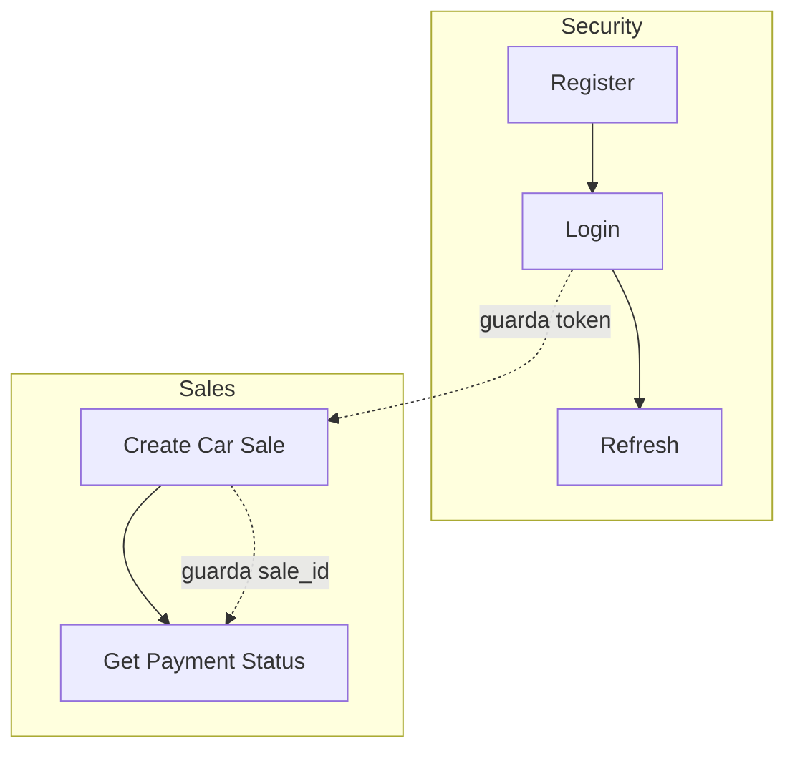

🌐 **Idioma:** Español · [English](../../en/07-Testing/01-Postman-Collection.md)
🏠 [[../00-Home|Inicio]] › Testing › Colección de Postman

# 🧪 Colección de Postman

El repositorio incluye una colección de Postman real, usada para probar el flujo end-to-end manualmente.

📎 **Archivo:** [`order-processing-platform.postman_collection.json`](../../assets/postman/order-processing-platform.postman_collection.json)

## Cómo importarla

1. Abre Postman → **Import** → selecciona el archivo `.json` de arriba.
2. Crea un **Environment** con estas variables (la colección no trae uno exportado):

| Variable | Valor sugerido |
|---|---|
| `gateway_url` | `http://localhost:8080/api` |
| `order_url` | `http://localhost:8081/api` |
| `payment_url` | `http://localhost:8082/api` |
| `token` | *(se completa automáticamente, ver abajo)* |
| `sale_id` | *(se completa automáticamente, ver abajo)* |

## Estructura de la colección



### 🔐 Security
| Request | Método | Endpoint | Test script |
|---|---|---|---|
| **Register** | `POST` | `{{gateway_url}}/auth/register` | — |
| **Login** | `POST` | `{{gateway_url}}/auth/login` | Si `200`, guarda `token` en el environment |
| **Refresh** | `POST` | `{{gateway_url}}/auth/refresh` (header `Authorization: Bearer {{token}}`) | Si `200`, guarda el nuevo `token` |

### 📦 Sales
| Request | Método | Endpoint | Auth | Test script |
|---|---|---|---|---|
| **Create Car Sale** | `POST` | `{{order_url}}/sales` | header `Authorization: Bearer {{token}}` | Si `201`, guarda `sale_id` en el environment |
| **Get Payment Status** | `GET` | `{{payment_url}}/payments/sales/{{sale_id}}` | header `Authorization: Bearer {{token}}` | ⚠️ ver nota abajo |

> [!tip] Corre "Login" antes de "Sales"
> Ahora que `order-service` y `payment-service` tienen Spring Security, ambos requests de la carpeta **Sales** necesitan un `{{token}}` válido en el environment — corre **Login** primero (guarda el token automáticamente).

## Ejemplo de datos usados (Create Car Sale)

```json
{
  "customerEmail": "juan@example.com",
  "vehicleVin": "1HGCM82633A004352",
  "vehicleMake": "Honda",
  "vehicleModel": "Accord",
  "vehicleYear": 2023,
  "vehicleColor": "Azul",
  "vehicleMileage": 15000,
  "salePrice": 25000.00,
  "discount": 500.00
}
```

> [!warning] Requiere un `customer` pre-existente
> Igual que en [[../02-Setup/02-Local-Setup|Guía de Instalación Local]], `order-service` busca al cliente por `customerEmail` en la tabla `customers`. Antes de correr **Create Car Sale**, inserta manualmente un registro con `email = "juan@example.com"` en esa tabla (no hay endpoint para crear customers).

## 🐛 Inconsistencias detectadas en la colección

Revisando la colección junto con el código fuente real, encontré dos detalles que vale la pena conocer al usarla (el archivo de la colección ya incluye la corrección del punto 0):

0. ~~**Faltaba el header `Authorization` en "Create Car Sale".**~~ **Corregido.** Ahora que `order-service` exige JWT (ver [[../01-Architecture/04-Design-Decisions|Decisiones de Diseño]]), se agregó `Authorization: Bearer {{token}}` a esa request en el archivo de la colección.
1. **El test script de "Get Payment Status" está copiado de "Create Car Sale".** Verifica `pm.response.code === 201` y lee `jsonData.id` para volver a guardar `sale_id` — pero `GET /payments/sales/{saleId}` responde `200 OK`, no `201`, así que esa condición nunca se cumple (es inofensivo, simplemente el script no hace nada útil ahí).
2. **La request "Get Payment Status" incluye un body JSON** (el mismo payload de la venta) a pesar de ser un `GET`. Postman lo permite (`disableBodyPruning: true`), pero el body es ignorado por `payment-service` — se puede eliminar sin afectar el resultado.
3. **Formato de JSON inconsistente entre servicios:** la respuesta de `order-service` (`CarSaleResponse`) usa `snake_case` (`customer_id`, `sale_price`...), mientras que la de `payment-service` (`GET /payments/sales/{saleId}`) usa `camelCase` (`saleId`, `transactionId`...). Ver [[../04-API-Reference/02-Sales-Endpoints|Sales Endpoints]] y [[../04-API-Reference/03-Payment-Endpoints|Payment Endpoints]].

---

**Ver también:** [[../04-API-Reference/01-Authentication|Autenticación]] · [[../02-Setup/02-Local-Setup|Guía de Instalación Local]]
